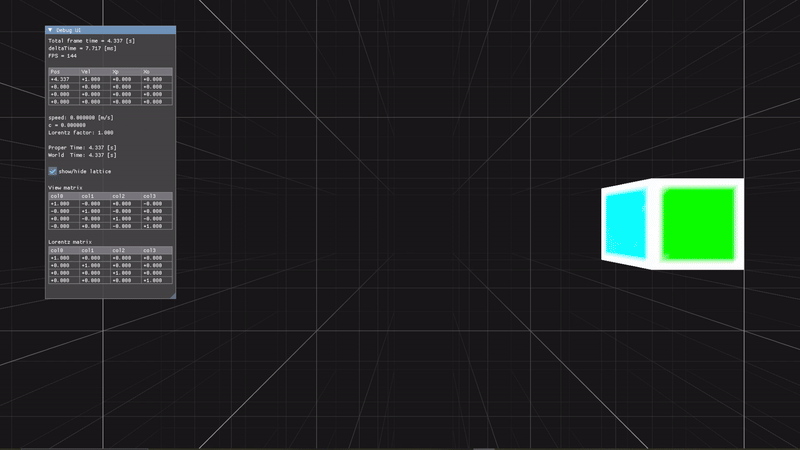

# VkMona / Special Relativistic Game Engine

  

This prototype game engine is the result of my desire of a game in which the speed of light matters. It is being developed as a learning project and also as a proof-of-concept. In its current state it is barely just that; a proof of concept. See below for a few gifs showcasing what it does. 

This project was mainly motivated by the Expeditionary Force novels written by Craig Alanson. The inspiration for some of the code is based on [LSBattle](https://github.com/sogebu/LSBattle), an implementation from the paper [Relativity For Games](https://arxiv.org/abs/1703.07063). The engine is based on the [Vulkan (c++) Game Engine Tutorials by Brendan Galea](https://www.youtube.com/playlist?list=PL8327DO66nu9qYVKLDmdLW_84-yE4auCR).

### Showcase
Travelling close to the speed of light leads to a hyperbolic rotation in time, the effects of which are modeled here by use of a Lorentz boost matrix in a vertex shader.

A cube accelerating to reach velocities close to the speed of light undergoes [length contraction](https://en.wikipedia.org/wiki/Length_contraction) and [Terrell rotation](https://en.wikipedia.org/wiki/Terrell_rotation)

A field of time clocks each blinking at the same time. Each time clock starts blinking at `t=0` (when the program starts) and then switches its on/off state every two seconds. The ring-like pattern is due to light-delay - it takes light longer to travel to the observer in the edges of the field of time clocks than in the middle of the field. When The observer accelerates away from the time clocks, it seems as if the clocks blink slower - this is the effects of [Time dilation](https://en.wikipedia.org/wiki/Time_dilation). Additionally you can see the [relativistic doppler effect](https://en.wikipedia.org/wiki/Relativistic_Doppler_effect) by the color of the time clocks.

### Progress

- [x] Lorentz boost shader showing the effects of [Terrell rotation](https://en.wikipedia.org/wiki/Terrell_rotation)
- [x] Objects in space have a worldline
- [x] Procedure for algorithmically finding the intersection between an object's worldline and the observer's past light cone
- [x] Doppler shifting of light when travelling close to the speed of light
- [x] [Time dilation](https://en.wikipedia.org/wiki/Time_dilation) effects
- [ ] Wormhole jump drive mechanics 

